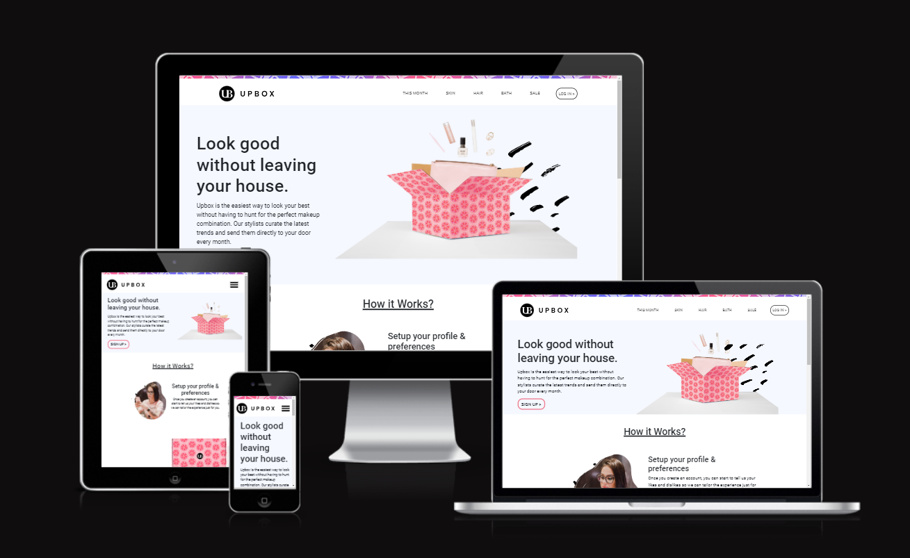

# UI Coding Challenge

UpBox Landing page was devloped using React.js and bootstrap with common breakpoints –

      For Mobile Devices – 320px — 480px
      iPads and Tablets – 481px — 768px
      Laptops and small screen – 769px — 1024px
      Large screens and Desktops – 1025px — 1200px
      TV and Extra Large Screens – 1201px and more

Netlify - [https://master--indira-ui-design-upbox.netlify.app/](https://master--indira-ui-design-upbox.netlify.app/)

Click to check the UI in responsive - [Am I Responsive - UpBox](https://ui.dev/amiresponsive?url=https://indira-ui-design-upbox.netlify.app/)

